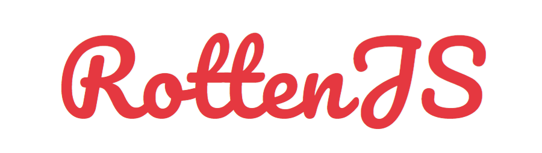

	
	 
	
A simple, light-weight (2.5kb) Javascript library for DOM

	 
	

## What is RottenJS ?
RottenJS is a light-weight (2.5kb) Javascript library for DOM. It is named 'Rotten' because it is in fact kinda terrible and is not well-built at all, and just technically a clone of jQuery. But, if you are interested in experimental or open-source projects, RottenJS is a good library for you :)

## Getting started
### Installation
You can clone RottenJS with git:

	git clone https://github.com/nguyenphuminh/RottenJS.git

Or install it in npm:

	npm i rottenjs

### Add RottenJS to your project
Add this tag to the 'head' tag of your .html files:

	

### [Functions and methods](DOCUMENTATION.md)

## Copyrights and License
Copyrights © 2020 Nguyen Phu Minh

This library is licensed under the MIT License